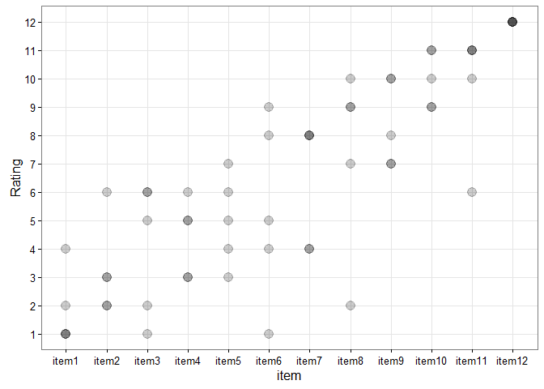
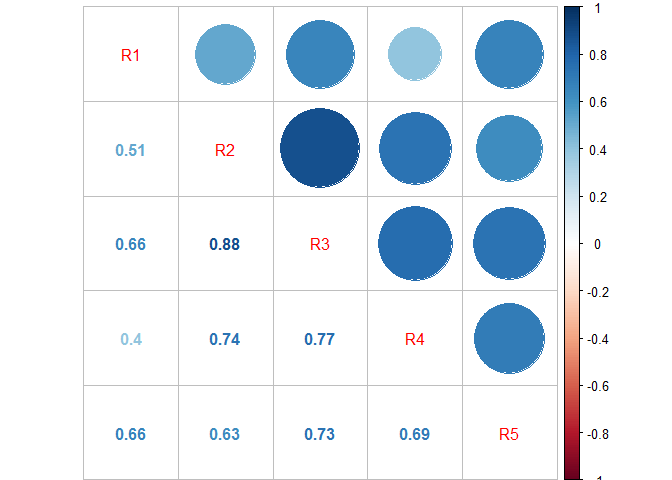

# Scorecard Example
Iris Kemp  
November 7, 2016  


## Scorecard

Given a scorecard where 5 raters were asked to assign ordinal ratings to 12 items, we want to evaluate inter-rater reliability. Simply, we want to determine how much consensus there is among raters. And, we want to use the R package `irr` to do this.

First, let's load the libraries we will use. 

```r
library(ggplot2)
library(reshape2)
library(corrplot)
library(irr)
```

Next, we create a scorecard:


```
##    item R1 R2 R3 R4 R5
##   item1  4  1  1  2  1
##   item2  3  2  2  3  6
##   item3  1  6  6  5  2
##   item4  5  3  3  6  5
##   item5  6  5  4  7  3
##   item6  9  4  5  1  8
##   item7  8  8  8  4  4
##   item8  2  9  7 10  9
##   item9  7 10 10  8  7
##  item10 11 11  9  9 10
##  item11 10  6 11 11 11
##  item12 12 12 12 12 12
```

Here's what these data look like:

<!-- -->

The darker the point, the more raters agreed on it's rating. On this scorecard, all raters agreed on the rating for item 12; all raters disagreed on the rating for items 5 and 6.

## Inter-rater reliability

There are several statistical measures appropriate for assessing inter-rater reliability. Let's pick a few from package `irr` to test. These ratings are ordinal, and we have more than two raters, so let's start by looking at pairwise correlation among raters, using Kendall's W, Spearman's rho, and Pearson's r. In this case the rating scale is continuous, so Pearson's is probably the best choice, but let's try them all.

### Kendall's W

The function `kendall` computes Kendall's coefficient of concordance. We'll set `correct = TRUE` to correct for ties within raters.


```r
kendall(scorecard[,2:6], correct = TRUE)
```

```
##  Kendall's coefficient of concordance Wt
## 
##  Subjects = 12 
##    Raters = 5 
##        Wt = 0.735 
## 
## Chisq(11) = 40.5 
##   p-value = 2.99e-05
```

This tells us that Kendall's W is approximately 0.7. Kendall's W ranges from 0 (no agreement) to 1 (complete agreement). Raters generally agreed with each other. 

### Spearman's rho

The function `meanrho` computes the mean of Spearman's rho rank correlations between pairs of raters. This measure is not a very good metric for this dataset, due to the presence of ties among raters.

Here is a visualization of the Spearman's rho correlation matrix:
<!-- -->

You can see that raters 2 and 3 had highest agreement with each other (correlation of 0.89). 


```r
meanrho(scorecard[,2:6])
```

```
##  Mean of bivariate rank correlations Rho
## 
##  Subjects = 12 
##    Raters = 5 
##       Rho = 0.692 
## 
##         z = 2.08 
##   p-value = 0.0378 
## 
##  Coefficient may be incorrect due to ties
```

Note that we can also calculate the mean of the correlation matrix in base R with `mean(corrmatrix[lower.tri(corrmatrix)])`.

### Pearson's r

The function `meancor` computes the mean of Pearson's product moment correlations between pairs of raters.

Here's a visualization of the correlation matrix: 
<!-- -->

Notice how similar the correlation matrices we have calculated through these two different methods are - almost identical. Pearson's r is computed based on the true values of the variables in question (thus reflecting a linear relationship), while Spearman's rho is computed on ranks (thus reflecting a monotonic relationship). So in this case, they both produce similar results.


```r
meancor(scorecard[,2:6])
```

```
##  Mean of bivariate correlations R
## 
##  Subjects = 12 
##    Raters = 5 
##         R = 0.688 
## 
##         z = 2.06 
##   p-value = 0.0391
```

And as we might expect, the mean is also very similar. 

### ICC

We could also compute the intraclass correlation coefficient (which I am less familiar with, but it's convenient to do with package `irr`). Here data are centered and scaled using a pooled mean and standard deviation.

We'll choose a `oneway` model and compute raters' `agreement`. The `icc` function call doesn't allow me to specify which ICC estimate I want to use (maybe try package `ICC`?), but has ICC(1) in the output. Probably someone who is familiar with this correlation knows what that means.


```r
icc(scorecard[,2:6], model = "oneway", type = "agreement")
```

```
##  Single Score Intraclass Correlation
## 
##    Model: oneway 
##    Type : agreement 
## 
##    Subjects = 12 
##      Raters = 5 
##      ICC(1) = 0.688
## 
##  F-Test, H0: r0 = 0 ; H1: r0 > 0 
##    F(11,48) = 12 , p = 2.16e-10 
## 
##  95%-Confidence Interval for ICC Population Values:
##   0.462 < ICC < 0.876
```

The internet tells me that an inter-rater agreement measure of 0.7 falls in the "good" agreement category. Since I'm not familiar with the math behind this coefficient and can't be bothered to look it up at the moment, I suppose we'll move forward. Note: this is not a recommended method of statistical analysis. 

## Some random bootstrapping stuff

Say we're curious about whether one rater has an undue effect on overall rater agreement. One very simple way to test this would be to remove each rater from the sample and see what impact that has on the results. Using Pearson's r, let's try it. 


The table of results is: 

```r
print(bootresults, row.names = FALSE)
```

```
##                test mean diff.from.mean
##  include all raters 0.69           0.00
##      remove Rater 1 0.75           0.06
##      remove Rater 2 0.67          -0.02
##      remove Rater 3 0.62          -0.07
##      remove Rater 4 0.70           0.01
##      remove Rater 5 0.69           0.00
```

## Conclusions

Inter-rater reliability was good, as shown by a variety of metrics (some more appropriate to this particular sample dataset than others). Generally raters agreed with each other. 

Rater 1 disagreed most with other raters. We can visually see this from the plot, and we can see that the agreement index based on Pearson's r improved by the largest margin when Rater 1 was removed from the dataset. Raters 2 & 3 were most similar to each other, and removing Rater 3 from the dataset produced the lowest agreement index of any scenario. However, as we did not do any significance testing in this example, we cannot determine whether any given rater was significantly different from the other raters.

Although not addressed directy in this example, the variability of ratings among items is also interesting and could be explored further. Some items had low variability, as seen in cases where the spread of points in the plot is small (or 0, as in the case of item 12). Other items had higher variability. Items 3, 6, 8, and 11 all had spreads of 5 or more between the lowest and highest ratings. Items 5 and 6 were universally disagreed upon. 
